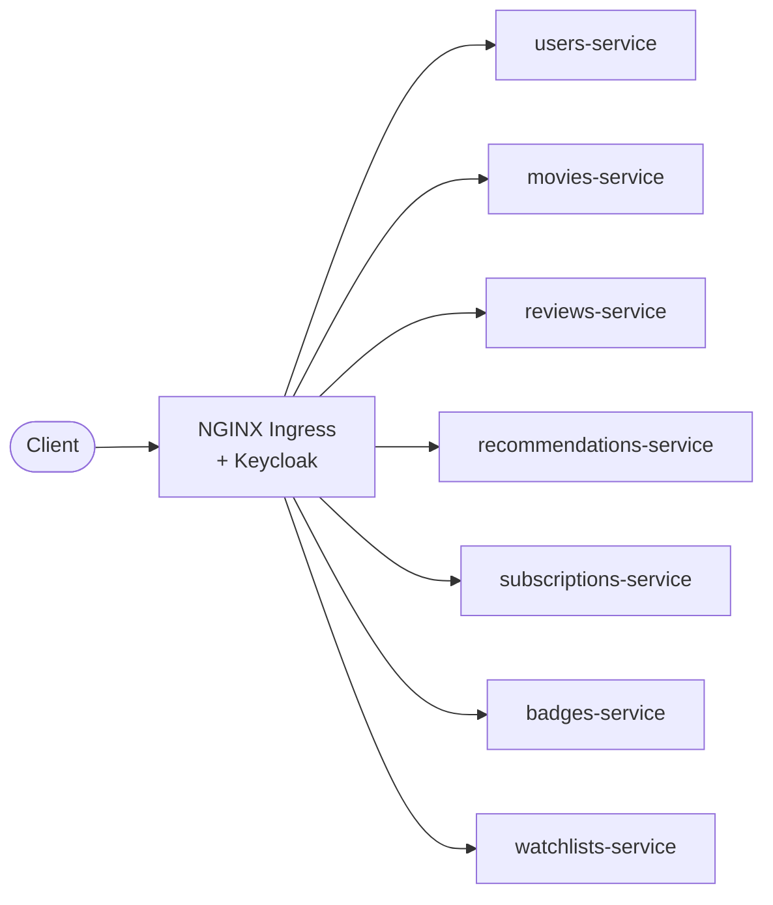
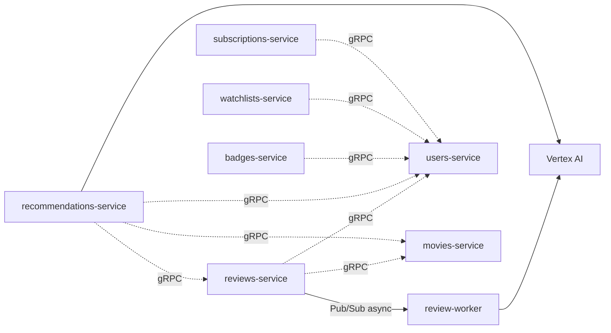

# Cloud-Native Movie Platform
**Movies, Reviews, Watchlists and Recommendation Aggregator**
**Course:** Cloud Computing | 2025/2026

## Group 8
Joana Carrasqueira, 64414

Leonor Silva, 59811

Tiago Pereira, 55854

Tiago Pina, 66101

---
## Motivation
The project addresses the challenge of building a scalable, cloud-native content platform that unifies movie discovery, community engagement, and AI-powered personalisation in a single deployable system.

The platform was built on top of real-world datasets — **MovieLens 25M** (25 million ratings across 62,424 movies by 162,541 users) and **IMDb Non-Commercial Datasets** — and deployed entirely on **Google Kubernetes Engine (GKE)**, following modern microservices architecture principles.

The core motivation is to demonstrate that a production-grade platform with authentication, async processing, AI features, observability, and CI/CD automation can be built and operated cost-efficiently on public cloud infrastructure.

## What the Project Is About

The project is a **cloud-native movie platform** that provides:

- A **unified movie catalog** with browsing, filtering, and full-text search
- A **public review and rating system** (1.0–5.0 scale) with optional written reviews
- **AI-powered sentiment analysis** of user reviews via Google Vertex AI (Gemini 2.5 Flash), processed asynchronously through GCP Pub/Sub
- A **personalised recommendation engine** with natural language explanations, driven by user genre preferences and viewing history
-  **Personal watchlists** for organising movies for future viewing
- An **engagement badge system** awarding milestones and streaming real-time events via SSE
-  A **subscription system** with free and premium tiers
- **Centralised authentication** via Keycloak with JWT (RS256) and role-based access control

### Dataset Summary

| Dataset | Source | Size | Records |
|---|---|---|---|
| MovieLens 25M | GroupLens | 1.07 GB | 25M ratings, 62,424 movies, 162,541 users |
| IMDb Non-Commercial | IMDb | ~6 GB compressed | Title metadata, ratings, people, principals |

## Architecture

### Application Architecture
The platform follows a **microservices architecture** — 8 independently deployable services, each owning its isolated PostgreSQL 15 database. There is no shared database between services. Cross-service data access is handled exclusively through gRPC (synchronous) or GCP Pub/Sub (asynchronous).

**Diagram 1 — Request flow (REST)**

**Diagram 2 — Inter-service communication (gRPC + async)**

> Each service owns an isolated PostgreSQL 15 database. Storage ranges from 2 Gi (most services) to 8 Gi (movies and ratings).

### Inter-Service Communication

| Caller                          | Calls (via gRPC)                               |
| ------------------------------- | ---------------------------------------------- |
| reviews-service                 | users-service, movies-service                  |
| recommendations-service         | users-service, movies-service, reviews-service |
| badges-service                  | users-service                                  |
| subscriptions-service           | users-service                                  |
| watchlists-service              | users-service                                  |
| reviews-service → review-worker | GCP Pub/Sub (async)                            |

### Infrastructure

| Component | Technology |
|---|---|
| Container Orchestration | GKE (Kubernetes) — 3× e2-standard-2 nodes |
| Ingress | NGINX Ingress Controller |
| TLS | cert-manager + Let's Encrypt |
| Authentication | Keycloak 24 (JWT RS256) |
| Secret Management | External Secrets Operator + GCP Secret Manager |
| Observability | Prometheus + Grafana |
| Async Messaging | GCP Pub/Sub |
| AI / ML | Vertex AI — Gemini 2.5 Flash |
| Image Registry | Docker Hub |
| Deployment Automation | Terraform + Ansible |

---

##  Implemented Microservices & Endpoints

All APIs are served over HTTPS via NGINX Ingress and documented at `/<service>/docs` (Swagger UI). Write operations and personalised endpoints require a Bearer JWT from Keycloak.

---

###  users-service - User Identity & Access Management

| Method   | Endpoint                               | Auth   | Description                       |
| -------- | -------------------------------------- | ------ | --------------------------------- |
| `POST`   | `/users-service/users`                 | Public | Register a new user               |
| `POST`   | `/users-service/login`                 | Public | Authenticate and obtain JWT token |
| `GET`    | `/users-service/users`                 | Public | List users with filters           |
| `GET`    | `/users-service/users/{user_id}`       | Public | Get user profile                  |
| `PUT`    | `/users-service/users/{user_id}`       | User   | Update own profile                |
| `DELETE` | `/users-service/users/{user_id}`       | User   | Delete own account                |
| `PATCH`  | `/users-service/users/{user_id}/admin` | Admin  | Grant or revoke admin role        |
### movies-service — Movie Catalog

| Method   | Endpoint                                           | Auth   | Description                             |
| -------- | -------------------------------------------------- | ------ | --------------------------------------- |
| `GET`    | `/movies-service/movies`                           | Public | List movies with filters and pagination |
| `POST`   | `/movies-service/movies`                           | Admin  | Create movie                            |
| `GET`    | `/movies-service/movies/{movie_id}`                | Public | Get movie detail                        |
| `PUT`    | `/movies-service/movies/{movie_id}`                | Admin  | Update movie                            |
| `DELETE` | `/movies-service/movies/{movie_id}`                | Admin  | Soft-delete movie                       |
| `GET`    | `/movies-service/genres`                           | Public | List all genres                         |
| `GET`    | `/movies-service/movies/{movie_id}/cast`           | Public | Get movie cast                          |
| `POST`   | `/movies-service/movies/{movie_id}/cast`           | Admin  | Add cast member                         |
| `DELETE` | `/movies-service/movies/{movie_id}/cast/{cast_id}` | Admin  | Remove cast member                      |
###  reviews-service — Review & Rating System

| Method | Endpoint | Auth | Description |
|---|---|---|---|
| `POST` | `/reviews-service/ratings` | User | Submit rating and optional review |
| `GET` | `/reviews-service/ratings` | Public | List ratings with filters |
| `GET` | `/reviews-service/ratings/{rating_id}` | Public | Get rating |
| `PUT` | `/reviews-service/ratings/{rating_id}` | User | Update own rating |
| `DELETE` | `/reviews-service/ratings/{rating_id}` | User | Delete own rating |
| `POST` | `/reviews-service/movies/{movie_id}/ratings` | User | Submit rating for a specific movie |
| `GET` | `/reviews-service/movies/{movie_id}/ratings` | Public | Get all ratings for a movie |
| `GET` | `/reviews-service/users/{user_id}/ratings` | Public | Get all ratings by a user |
| `GET` | `/reviews-service/movies/{movie_id}/review-summary` | Public | Get aggregated sentiment and topics |

> **Async pipeline:** on review submission, a message is published to the `review-created` Pub/Sub topic. The `review-worker` consumes it and calls Vertex AI for sentiment classification (positive / negative / neutral) and topic extraction (up to 5 topics), without blocking the HTTP response.

---

### recommendations-service — Personalised Recommendation Engine

| Method | Endpoint | Auth | Description |
|---|---|---|---|
| `POST` | `/recommendations-service/users/{user_id}/preferences` | User | Add genre preference |
| `GET` | `/recommendations-service/users/{user_id}/preferences` | User | Get genre preferences |
| `DELETE` | `/recommendations-service/users/{user_id}/preferences/{genre_id}` | User | Remove genre preference |
| `POST` | `/recommendations-service/users/{user_id}/reference-movies` | User | Add reference movie |
| `GET` | `/recommendations-service/users/{user_id}/reference-movies` | User | Get reference movies |
| `DELETE` | `/recommendations-service/users/{user_id}/reference-movies/{movie_id}` | User | Remove reference movie |
| `GET` | `/recommendations-service/recommendations/{user_id}` | User | Get personalised recommendations |
| `GET` | `/recommendations-service/recommendations/{user_id}/explained` | User | Get recommendations with AI explanations |

### subscriptions-service — Subscription System

| Method | Endpoint | Auth | Description |
|---|---|---|---|
| `POST` | `/subscriptions-service/users/{user_id}/subscription` | User | Create subscription |
| `GET` | `/subscriptions-service/users/{user_id}/subscription` | User | Get subscription |
| `PUT` | `/subscriptions-service/users/{user_id}/subscription` | User | Update subscription |
| `DELETE` | `/subscriptions-service/users/{user_id}/subscription` | User | Cancel subscription |

### badges-service — Engagement Badges

| Method | Endpoint | Auth | Description |
|---|---|---|---|
| `GET` | `/badges-service/badges` | Public | List all badge definitions |
| `POST` | `/badges-service/badges` | Admin | Create badge definition |
| `GET` | `/badges-service/badges/{badge_id}` | Public | Get badge |
| `PUT` | `/badges-service/badges/{badge_id}` | Admin | Update badge |
| `DELETE` | `/badges-service/badges/{badge_id}` | Admin | Delete badge |
| `GET` | `/badges-service/users/{user_id}/badges` | Public | List badges awarded to a user |
| `POST` | `/badges-service/users/{user_id}/badges` | Admin | Award badge to a user |
| `GET` | `/badges-service/users/{user_id}/badges/stream` | User | SSE stream of badge award events |

### watchlists-service — Watchlist Management

| Method | Endpoint | Auth | Description |
|---|---|---|---|
| `GET` | `/watchlists-service/watchlists` | Public | List all watchlists |
| `POST` | `/watchlists-service/watchlists` | User | Create watchlist |
| `GET` | `/watchlists-service/watchlists/{watchlist_id}` | Public | Get watchlist with movies |
| `PUT` | `/watchlists-service/watchlists/{watchlist_id}` | User | Update watchlist title |
| `DELETE` | `/watchlists-service/watchlists/{watchlist_id}` | User | Delete watchlist |
| `POST` | `/watchlists-service/watchlists/{watchlist_id}/movies` | User | Add movie to watchlist |
| `DELETE` | `/watchlists-service/watchlists/{watchlist_id}/movies/{movie_id}` | User | Remove movie from watchlist |
| `GET` | `/watchlists-service/users/{user_id}/watchlist` | User | Get all watchlists for a user |

## Technology Stack

| Layer           | Technology                               |
| --------------- | ---------------------------------------- |
| Web Framework   | FastAPI (Python)                         |
| ORM             | SQLAlchemy 2.0                           |
| Database        | PostgreSQL 15 (one instance per service) |
| gRPC            | grpcio 1.78                              |
| JWT Validation  | python-jose[cryptography] — RS256/JWKS   |
| HTTP Client     | httpx                                    |
| Metrics         | prometheus-fastapi-instrumentator        |
| AI Integration  | google-genai (Vertex AI)                 |
| Async Messaging | google-cloud-pubsub                      |

